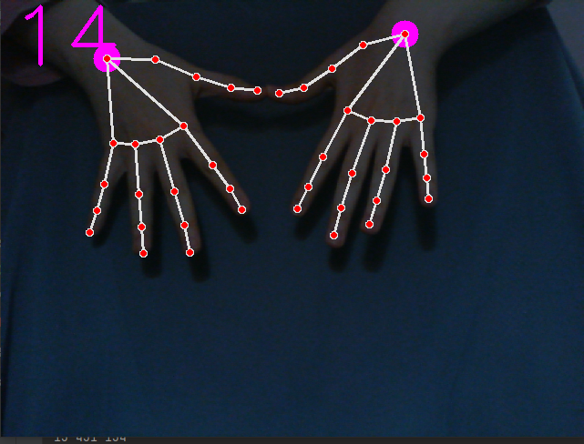
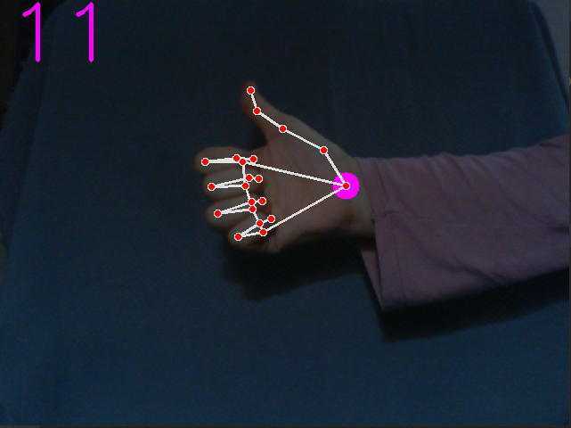

# Hand-Tracking

<h3>Hand traking consitsts of two part:</h3>
1- Palm Detection 
Works on complete images and provide cropped image of the hand. 

2- Hand LandMarks: 
find 21 land marks of this cropped image of the hand. 

I used <b>MediaPipe</b> Framework. 
MediaPipe is Google's open-source framework, used for media processing. 
It is cross-platform or we can say it is platform friendly. It is run on Android, iOS, web, and YouTube servers that's what Cross-platform means, to run everywhere. 

To train thus land mark using MediaPipe, they manually anotated 30.000 images of different hands.

